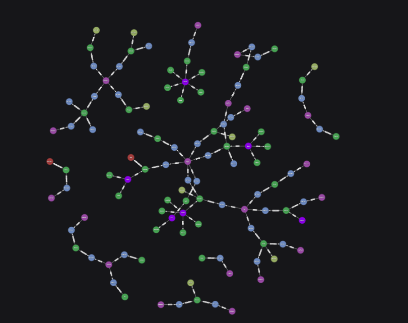
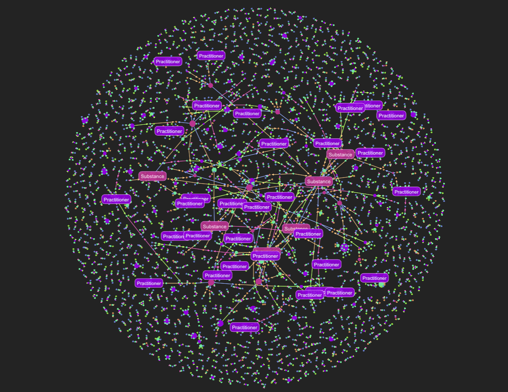

Agentic Workflows for Graph RAG
================

### ODSC Agentic AI Summit 2025 Workshop

By GraphGeeks

----

:spiral_calendar:  July 16 - 31, 2025

:world_map:        Virtual

:writing_hand:     [AI Summit Track](https://www.summit.ai/#Tracks)

----

## All you really need to know

- Basics of Python
- Basic familiarity with vector search
- How to use the terminal and modern IDEs (like VS Code or Cursor)

### Tips to get started

After you've attended the sessions, we recommend cloning this repo and following our [tips to get started](./TIPS.md).

## Instructors

This 3-part workshop is led by a team of 4 instructors.

* [Amy Hodler](https://www.linkedin.com/in/amyhodler)
* [Dennis Irorere](https://www.linkedin.com/in/dennis-irorere)
* [Prashanth Rao](https://www.linkedin.com/in/prrao87)
* [David Hughes](https://www.linkedin.com/in/dahugh)

## Dataset

This workshop uses a dataset of 2,726 FHIR records of patients and their notes. The dataset is obtained
from this [Hugging Face dataset](https://huggingface.co/datasets/kishanbodybrain/test-fhir/tree/main/data)
and preprocessed using the script `create_dataset.py`.

To create the dataset locally, run the following command:

```bash
uv run create_dataset.py
```

This creates the following two JSON files:

- Raw data: 2,726 notes in unstructured text format, output to `data/note.json`
- Evaluation data: 2,726 FHIR JSON records, output to `data/fhir.json`

## Setup Python environment

It's recommended to [install uv](https://docs.astral.sh/uv/getting-started/installation/) to manage the dependencies.

```bash
uv sync
```
Alternatively, you can install the dependencies manually via pip.

```bash
pip install -r requirements.txt
```

## Components

### 1. Information extraction

Our first goal is to extract entities and relationships that can form a knowledge graph from
the raw data (patient notes) in the `data/note.json` file. The information extraction pipeline
is powered by [BAML](https://www.boundaryml.com/), a programming language for obtaining high-quality
structured outputs from LLMs.

### 2. Store the graph in Kuzu

[Kuzu](https://kuzudb.com/) is an embedded (in-process) graph database that we use to persist the
graph and query it using Cypher.

### 3. Store embeddings of the notes in LanceDB

We'll use [LanceDB](https://lancedb.com/) to store the embeddings of the notes. A vector index
and a full-text search (FTS) index are created, so that we can run a hybrid search (vector + FTS)
search on the data.

## Evaluation

There are two parts to the evaluation on our system:

1. Evaluating the quality of the graph construction
2. Evaluating the quality of the Graph RAG and agent pipeline

#### 1. Graph construction evaluation

The evaluation data in `data/fhir.json` is used to evaluate the
quality of results from the information extraction pipeline in BAML.

See the [evaluation script](src/baml_extract_eval.py).

#### 2. Graph, vector and FTS-based (hybrid) RAG and agent pipeline evaluation

We evaluate the RAG system that consists of a combination of graph, vector and FTS-based RAG
using the [Opik](https://www.comet.com/site/products/opik/) observability tool. The code for
evaluating the RAG system instruments the BAML prompts with Opik so that we can trace the execution
of each stage and quantify the system's performance. Guardrails are also added to showcase how to
protect from sensitive data leaking out of the system.

See the following docs in this repo for more details:
- [BAML instrumentation](src/BAML_INSTRUMENTATION_README.md)
- [Guardrails](src/GUARDRAILS_README.md)

## Graph visualization

It can help to visualize the graph to understand the structure of the data. Two options are provided
below.

### Option 1: Kuzu Explorer (Requires Docker)
Once the knowledge graph has been created in Kuzu, you can visualize it using the
[Kuzu Explorer](https://docs.kuzudb.com/visualization/kuzu-explorer/#what-is-kuzu-explorer)tool.

Use the provided `docker-compose.yml` configured with the relative path to your data, and
start the Docker container for Kuzu explorer as follows:

```bash
docker compose up
```

Once finished, spin down the Kuzu Explorer container:

```bash
docker compose down
```

You can view multi-hop paths in the graph as follows:
```cypher
MATCH (a)-[r*1..4]-(b) RETURN * LIMIT 500;
```



### Option 2: G.V()

Alternatively, you can use the [G.V()](https://gdotv.com/) tool to visualize the graph.
This is an all-in-one graph database client to write, debug, test and analyze results for your graph database of choice. G.V() comes with first-class support for Kuzu databases -- simply drag-drop
your Kuzu graph database file into the G.V() desktop app, and you're good to go!

The full graph as visualized in G.V() is shown below:



## Running the evaluation program

The `rag_obs_eval.py` script provides a comprehensive evaluation framework for the hybrid RAG system. It runs a suite of predefined questions through the complete pipeline, combining graph-based RAG (using Kuzu) with vector and full-text search RAG (using LanceDB). The evaluation is instrumented with [Opik](https://www.comet.com/site/products/opik/) observability to provide detailed tracing and metrics for each stage of the workflow.

To run the evaluation:

```bash
cd src
uv run rag_obs_eval.py
```

The evaluation program demonstrates several key features:

- **Hybrid RAG**: Combines graph queries with vector search for comprehensive information retrieval
- **BAML Instrumentation**: All BAML function calls are tracked with detailed usage metrics, timing, and cost analysis
- **Guardrails Integration**: Input and output validation with configurable email detection and masking
- **Observability**: Complete tracing of the RAG pipeline with Opik spans and metrics
- **Evaluation Metrics**: Automated scoring using Heuristics & LLM-as-a-judge for contains check, hallucination detection, answer relevance, moderation, and usefulness

The program processes a set of healthcare-related questions and generates synthesized answers by combining results from both graph and vector search approaches. Each step is instrumented to provide visibility into the system's performance and behavior.

## Viewing results in the Opik Dashboard

After running the evaluation program, you can view detailed results and metrics in the Opik Dashboard. The evaluation generates comprehensive traces that include:

- **Complete workflow traces** showing the execution flow of each question
- **BAML function calls** with timing, token usage, and cost analysis
- **Guardrail validations** for input and output processing
- **Evaluation metrics** including hallucination detection, answer relevance, moderation, and usefulness scores
- **Performance data** for each stage of the hybrid RAG pipeline

### Setting up Opik access

You have two options for accessing the Opik Dashboard:

#### Option 1: Opik Cloud (Recommended for workshop participants)

1. **Create a free account** at [Opik Cloud](https://www.comet.com/site/products/opik/)
2. **Set up environment variables** in your `.env` file:
   ```bash
   OPIK_API_KEY=your_api_key_here
   OPIK_WORKSPACE=your_workspace_name
   OPIK_PROJECT_NAME=ODSC-RAG
   ```
3. **Run the evaluation** - traces will automatically be sent to your Opik Cloud project
4. **Access the dashboard** at the URL provided in the console output after running the evaluation

#### Option 2: Local Opik deployment

For users who prefer to run Opik locally:

1. **Deploy Opik locally** following the [Opik documentation](https://www.comet.com/docs/opik/self-host/overview)
2. **Configure for local usage** by setting `opik.configure(use_local=True)` in the evaluation script
3. **Access the local dashboard** at your local Opik instance URL

### Navigating the Opik Dashboard

Once you have access to the Opik Dashboard, you can explore the evaluation results through:

- **Traces view**: See the complete execution flow for each question
- **Spans view**: Drill down into individual function calls and their performance
- **Metrics view**: Analyze evaluation scores and performance metrics
- **Feedback scores**: Review LLM-as-a-judge evaluations for answer quality
- **Usage analytics**: Monitor token consumption and costs across the pipeline

The dashboard provides interactive visualizations that help you understand:
- Which questions performed best/worst
- Where bottlenecks occur in the RAG pipeline
- How guardrails are protecting sensitive data
- Cost analysis for different components of the system

For detailed information about the instrumentation and guardrails implementation, see:
- [BAML Instrumentation Guide](src/BAML_INSTRUMENTATION_README.md)
- [Guardrails Implementation](src/GUARDRAILS_README.md)
