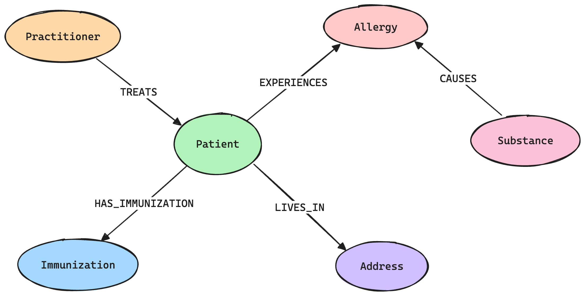
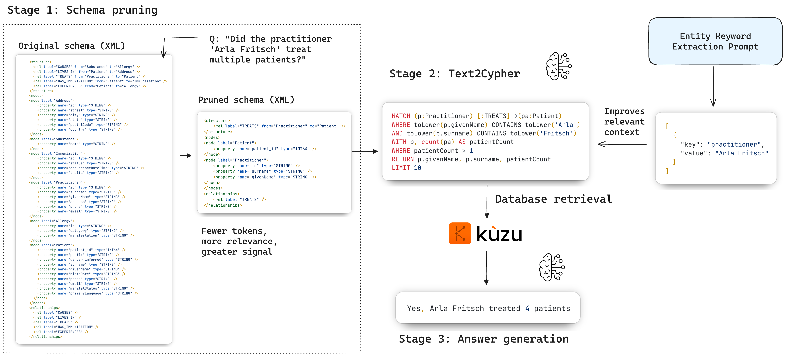
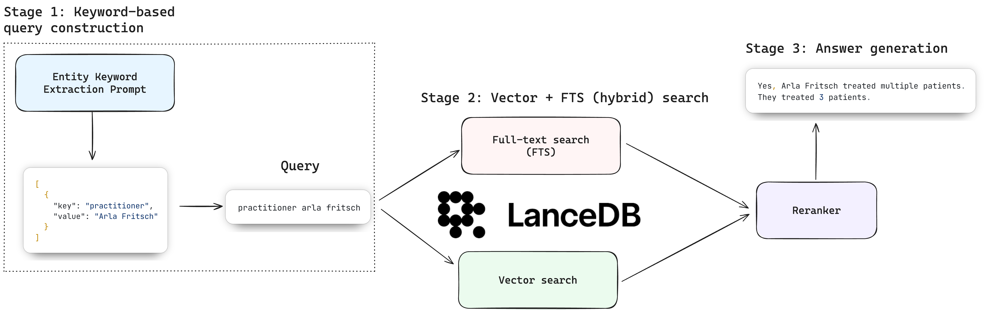
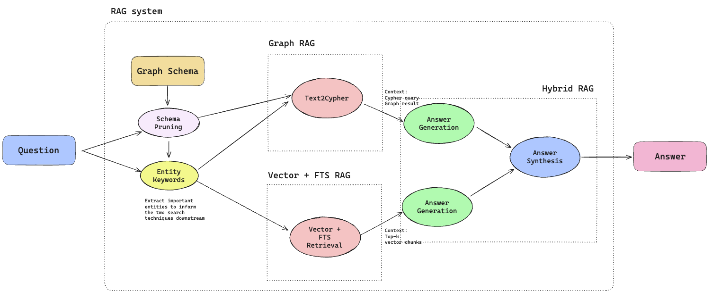

# Code

Let's look at the sequence of steps that we take to build a knowledge graph from the unstructured
text, store it in a graph and vector database, and build a hybrid RAG system whose performance we
then evaluate.

## 1. Data extraction

We start by extracting the data from the FHIR graph database using BAML.

```bash
uv run baml_extract.py
```
This runs a BAML pipeline that calls the necessary prompts from the BAML client code, and the LLM
returns structured outputs that are stored in the `data/extracted_fhir.json` file. The source prompts
in BAML are in the `baml_src/extract_fhir.baml` file.

To evaluate the quality of the outputs, an evaluation script is provided to evaluate the quality of the extracted data.
```bash
$ uv run baml_extract_eval.py
```
```
=== INFORMATION EXTRACTION EVALUATION RESULTS ===

Total Records: 2726
family: 2517/2726 (92.3%)
 First 10 failed IDs: [45, 97, 422, 441, 448, 474, 482, 499, 502, 506]
given: 2336/2726 (85.7%)
 First 10 failed IDs: [129, 272, 413, 422, 430, 442, 444, 445, 448, 453]
prefix: 2606/2726 (95.6%)
 First 10 failed IDs: [13, 15, 28, 37, 80, 123, 126, 141, 145, 161]
line: 2460/2726 (90.2%)
 First 10 failed IDs: [39, 41, 75, 85, 90, 103, 115, 149, 193, 261]
city: 2510/2726 (92.1%)
 First 10 failed IDs: [263, 288, 326, 357, 403, 417, 422, 435, 469, 471]
state: 2514/2726 (92.2%)
 First 10 failed IDs: [263, 288, 326, 357, 403, 417, 435, 440, 449, 462]
postalCode: 2503/2726 (91.8%)
 First 10 failed IDs: [8, 28, 33, 34, 39, 100, 116, 141, 163, 188]
country: 2528/2726 (92.7%)
 First 10 failed IDs: [422, 440, 449, 462, 468, 492, 496, 497, 498, 504]
gender: 2497/2726 (91.6%)
 First 10 failed IDs: [20, 44, 49, 50, 58, 79, 89, 102, 103, 115]
birthDate: 2710/2726 (99.4%)
 First 10 failed IDs: [179, 611, 1173, 1234, 1344, 1420, 1536, 1637, 1648, 2113]
maritalStatus: 2686/2726 (98.5%)
 First 10 failed IDs: [103, 182, 238, 240, 283, 291, 292, 303, 316, 387]
practitioner: 2651/2726 (97.2%)
 First 10 failed IDs: [15, 27, 82, 140, 166, 274, 315, 329, 388, 417]
allergyRecordedCount: 2637/2726 (96.7%)
 First 10 failed IDs: [45, 114, 151, 159, 166, 224, 239, 242, 243, 248]
immunizationCount: 2642/2726 (96.9%)
 First 10 failed IDs: [18, 77, 117, 126, 155, 182, 246, 260, 273, 282]
immunizationDate: 2602/2726 (95.5%)
 First 10 failed IDs: [63, 68, 77, 141, 162, 206, 221, 242, 245, 247]

Overall accuracy (across all fields):
38399/40890 (93.9%)

Total comparisons: 40890
Failed comparisons: 2491
```

## 2. Store the knowledge graph in Kuzu

Once we have the extracted data in `data/extracted_fhir.json`, we can store the knowledge graph in Kuzu.
The following graph schema is used:



The data is ingested into Kuzu by running the following script:

```bash
uv run build_graph.py
```
This creates a Kuzu database in the `fhir_kuzu_db` directory.

The workflow in Kuzu can be visualized as follows:



## 3. Store the notes vector embeddings in LanceDB

We also compute and store vector embeddings for the patient notes (which are unstructured text) in LanceDB. The embeddings are computed using the `ollama/nomic-embed-text` model, which has a context window of 2k tokens.
Ensure that you have the `ollama` CLI [installed](https://ollama.readthedocs.io/en/quickstart/), and pull the embedding model using the command `ollama pull nomic-embed-text`.

```bash
uv run generate_note_embeddings.py
```
The embeddings are computed and persisted to a LanceDB database in the `fhir_lance_db` directory.

> [!NOTE]
> Because keywords are particularly important for the RAG pipeline, we also compute a full-text search
> (FTS) index for the patient notes in LanceDB. The FTS index is also stored in the same LanceDB database.

The workflow in LanceDB can be visualized as follows:



## 4. Run the Hybrid RAG pipeline

The hybrid RAG pipeline is implemented in the `rag.py` file. It uses the Kuzu database for structured
data, and the LanceDB database for unstructured data.

```bash
uv run rag.py
```

This runs the hybrid RAG pipeline for a set of questions, and prints the results.

The hybrid RAG pipeline can be visualized as follows:



### (Optional): UI to query the Hybrid RAG system

You can run the simple streamlit UI provided to query the Hybrid RAG system in natural language.

```bash
uv run streamlit run ui.py
```

### Run the tests

A deterministic pytest test suite is provided as an initial sanity check (prior to using more advanced
evaluation methods). These tests evaluate only the _final outcome_ of the hybrid RAG pipeline. A suite
of 10 questions is provided in `tests/test_data.py` -- we can see that test number 10 (a counting query)
fails, which means that the Cypher query generated by this LLM that was then used to answer the question
is not correct, warranting further investigation.

```bash
$ uv run pytest -v
===================================================================================================== test session starts =====================================================================================================
platform darwin -- Python 3.13.2, pytest-8.4.1, pluggy-1.6.0 -- /path/to/code/odsc-agentic-ai-summit-2025/.venv/bin/python3
cachedir: .pytest_cache
rootdir: /path/to/code/odsc-agentic-ai-summit-2025
configfile: pyproject.toml
plugins: anyio-4.9.0, opik-1.8.2, asyncio-1.0.0
asyncio: mode=Mode.STRICT, asyncio_default_fixture_loop_scope=None, asyncio_default_test_loop_scope=function
collected 10 items                                                                                                                                                                                                            

tests/test_graphrag.py::test_graphrag_eval_expected_answer[test_case0] PASSED                                                                                                                                           [ 10%]
tests/test_graphrag.py::test_graphrag_eval_expected_answer[test_case1] PASSED                                                                                                                                           [ 20%]
tests/test_graphrag.py::test_graphrag_eval_expected_answer[test_case2] PASSED                                                                                                                                           [ 30%]
tests/test_graphrag.py::test_graphrag_eval_expected_answer[test_case3] PASSED                                                                                                                                           [ 40%]
tests/test_graphrag.py::test_graphrag_eval_expected_answer[test_case4] PASSED                                                                                                                                           [ 50%]
tests/test_graphrag.py::test_graphrag_eval_expected_answer[test_case5] PASSED                                                                                                                                           [ 60%]
tests/test_graphrag.py::test_graphrag_eval_expected_answer[test_case6] PASSED                                                                                                                                           [ 70%]
tests/test_graphrag.py::test_graphrag_eval_expected_answer[test_case7] PASSED                                                                                                                                           [ 80%]
tests/test_graphrag.py::test_graphrag_eval_expected_answer[test_case8] PASSED                                                                                                                                           [ 90%]
tests/test_graphrag.py::test_graphrag_eval_expected_answer[test_case9] FAILED                                                                                                                                           [100%]

========================================================================================================== FAILURES ===========================================================================================================
```
For a test to pass, the following conditions must be met:
- The Cypher query generated by the LLM must be correct, OR
- The context returned by Vector + FTS RAG must be useful to the LLM, OR
- _Both_ the above conditions are met

The pytest test suite is not exhaustive, and we will use more advanced evaluation methods for questions that
have subjective answers in the next section.

## 5. Evaluate the RAG system

We'll use the Opik observability platform to evaluate the RAG system in a more granular way, by sending
traces of our LLM outputs to Opik and creating experiments to evaluate the quality of the RAG system.

Set up an Opik account, and create a new project and workspace. Store the required environment variables
in the `.env` file as shown below.

```
OPIK_API_KEY=
OPIK_PROJECT_NAME=
OPIK_WORKSPACE=
```

Then, read the following docs for more details:
- [BAML instrumentation](BAML_INSTRUMENTATION_README.md)
- [Guardrails](GUARDRAILS_README.md)
